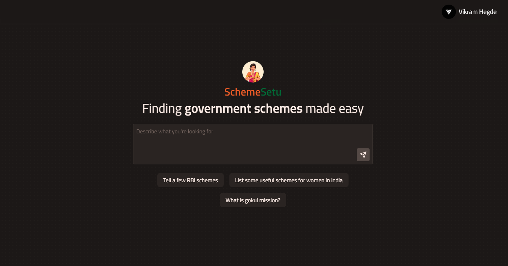

<br/>
<p align="center">
  <a href="https://github.com/VikramCodes/schemesetu">
    
  </a>

  <h3 align="center">SchemeSetu</h3>
  <p align="center">
    SchemeSetu is a tool that simplifies finding Indian government schemes by combining the power of vector databases and LLM's
    <br/>
    <br/>
    <a href="https://schemesetu.vercel.app">View Demo</a>
  </p>
</p>

## Table Of Contents

- [Table Of Contents](#table-of-contents)
- [About The Project](#about-the-project)
- [Built With](#built-with)
- [Getting Started](#getting-started)
  - [Prerequisites](#prerequisites)
  - [Installation](#installation)

## About The Project



SchemeSetu is an AI-powered chatbot designed to provide comprehensive information about Indian government schemes. Built with a robust technology stack including MongoDB, Pinecone, Zephyr-7b-beta, Next.js, and UnoCSS, the chatbot ensures accurate and accessible data on various health-related initiatives, immunization drives, and disease prevention programs. SchemeSetu's mission is to empower individuals with informed decision-making, promoting awareness and bridging the information gap. This project aligns with Sustainable Development Goals (SDGs), particularly SDG-3 for "Good Health and Well-being" and SDG-4 for "Quality Education."

## Built With

- Next JS
- PineconeDB
- MongoDB
- Vercel AI SDK
- UnoCSS
- Next Auth

## Getting Started

This is an example of how you may give instructions on setting up your project locally.
To get a local copy up and running follow these simple example steps.

### Prerequisites

This is an example of how to list things you need to use the software and how to install them.

- npm

```sh
npm install npm@latest -g
```

### Installation

1. Get a free API Key at [Hugging Face](https://huggingface.co/settings/tokens)

2. Clone the repo

```sh
git clone https://github.com/Vikram-Hegde/schemesetu.git
```

3. Install NPM packages

```sh
npm install
```

4. Enter your API in `.env`

```JS
const HUGGINGFACEHUB_API = 'ENTER YOUR API';
```
